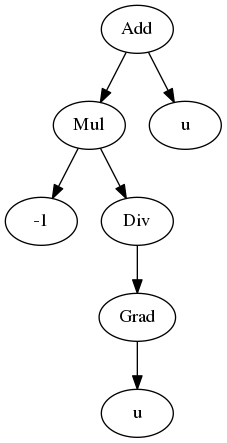
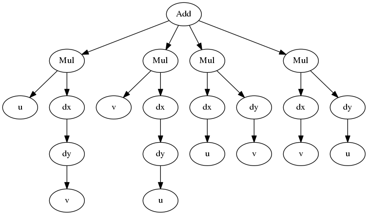

Quick start
***********

**sympde** allows you to create symbolic expressions using differential/algebraic operators. It can be used to define strong or weak forms, when dealing with finite elements methods.

Strong forms
^^^^^^^^^^^^

Assume you want to create the symbolic expression that is equivalent to

.. math:: 

  \mathcal{L} u := - \nabla^2 u + u

where :math:`u` denotes the *unknown* of 2 variables (2D).

In **sympde**, you can declare :math:`u` using

.. code-block:: python

  from sympde import Unknown

  u = Unknown('u', ldim=2)

The expression associated to the operator :math:`\mathcal{L}` is then defined as

.. code-block:: python

  from sympde import grad, div

  expr = - div(grad(u)) + u

you can also use a *lambda expression*

.. code-block:: python

  from sympde import grad, div

  L = lambda u: - div(grad(u)) + u

As any sympy expression, you can take a look at the diagram of the expression tree:

   Caption TODO.

.. note::

   The above diagram was made using `Graphviz <http://www.graphviz.org/>`_ and
   the `dotprint <https://github.com/sympy/sympy/blob/master/sympy/printing/dot.py>`_ function.

**sympde** allows to write more complicated expressions and it knows many differential calculus rules to perform the computation on its own.

Let us consider the following mathematical expression

.. math:: 

  \partial_x \partial_y uv

The symbolic associated expression can be achieved using

.. code-block:: python

  from sympde import Unknown
  from sympde import dx, dy

  u = Unknown('u', ldim=2)
  v = Unknown('v', ldim=2)

  expr = dx(dy(u*v))

Since we are using the atomic operators **dx** and **dy**, the expression will be automatically evaluated, in opposition to the use of **grad** or **div**. Hence, result is

.. code-block:: python

  >>>  u*dx(dy(v)) + v*dx(dy(u)) + dx(u)*dy(v) + dx(v)*dy(u)

and the associated expression tree is

   Caption TODO.

Weak forms
^^^^^^^^^^

Bilinear form
_____________

Linear form
___________

Function form
_____________
