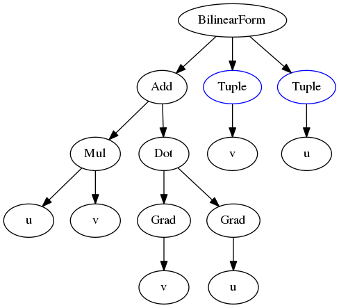

Quick start
***********

**sympde** allows you to create symbolic expressions using differential/algebraic operators. It can be used to define strong or weak forms, when dealing with finite elements methods.

Strong forms
^^^^^^^^^^^^

Assume you want to create the symbolic expression that is equivalent to

.. math:: 

  \mathcal{L} u := - \nabla^2 u + u

where :math:`u` denotes the *unknown* of 2 variables (2D).

In **sympde**, you can declare :math:`u` using

.. code-block:: python

  from sympde import Unknown

  u = Unknown('u', ldim=2)

The expression associated to the operator :math:`\mathcal{L}` is then defined as

.. code-block:: python

  from sympde import grad, div

  expr = - div(grad(u)) + u

you can also use a *lambda expression*

.. code-block:: python

  from sympde import grad, div

  L = lambda u: - div(grad(u)) + u

As any sympy expression, you can take a look at the diagram of the expression tree:

.. figure:: include/quick/graph1.png
   :scale: 70 %
   :alt: map to buried treasure

   Expression tree for the :math:`\mathcal{L} u := - \nabla^2 u + u` operator.

.. note::

   The above diagram was made using `Graphviz <http://www.graphviz.org/>`_ and
   the `dotprint <https://github.com/sympy/sympy/blob/master/sympy/printing/dot.py>`_ function.

**sympde** allows to write more complicated expressions and it knows many differential calculus rules to perform the computation on its own.

Let us consider the following mathematical expression

.. math:: 

  \partial_x \partial_y uv

The symbolic associated expression can be achieved using

.. code-block:: python

  from sympde import Unknown
  from sympde import dx, dy

  u = Unknown('u', ldim=2)
  v = Unknown('v', ldim=2)

  expr = dx(dy(u*v))

Since we are using the atomic operators **dx** and **dy**, the expression will be automatically evaluated, in opposition to the use of **grad** or **div**. Hence, result is

.. code-block:: python

  >>>  u*dx(dy(v)) + v*dx(dy(u)) + dx(u)*dy(v) + dx(v)*dy(u)

and the associated expression tree is

.. figure:: include/quick/graph2.png
   :scale: 70 %
   :alt: map to buried treasure

   Expression tree for :math:`\partial_x \partial_y uv`.

When evaluated, **sympde** differential operators are linear operators. Which means that the following code:

.. code-block:: python

  from sympde import Unknown
  from sympde import dx, dy

  u = Unknown('u', ldim=2)
  v = Unknown('v', ldim=2)

  expr = dy(2*u+3*v)

will return:

.. code-block:: python

  >>> 2*dy(u) + 3*dy(v)

**sympde** introduces the notion of a *constant* through the class **Constant**. As expected, applying a differential operator on it will return **0**:

.. code-block:: python

  from sympde import Unknown, Constant
  from sympde import dx

  u = Unknown('u', ldim=1)
  alpha = Constant('alpha')

  expr = dx(alpha*u) + dx(dx(2*u))

The result is:

.. code-block:: python

  >>> alpha*dx(u) + 2*dx(dx(u))

You can also apply a differential operator on an analytical function, which is useful to compute solution/rhs of a partial differential equation:

.. code-block:: python

  from sympde import Constant
  from sympde import dx, dy
  from sympy.abc import x, y
  from sympy import cos, exp

  alpha = Constant('alpha')

  L = lambda u: -dx(dx(u)) - dy(dy(u)) + alpha * u

  expr = L(cos(y)*exp(-x**2))

The result is:

.. code-block:: python

  >>> alpha*exp(-x**2)*cos(y) - 4*x**2*exp(-x**2)*cos(y) + 3*exp(-x**2)*cos(y)

sympy undefined can also be used:

.. code-block:: python

  from sympde import Constant
  from sympde import dx, dy
  from sympy.abc import x, y
  from sympy import Function

  alpha = Constant('alpha')
  f = Function('f')

  L = lambda u: -dx(dx(u)) - dy(dy(u)) + alpha * u

  expr = L(f(x,y))

which gives:

.. code-block:: python

  >>> alpha*f(x, y) - Derivative(f(x, y), x, x) - Derivative(f(x, y), y, y)

Weak forms
^^^^^^^^^^

Other useful notions for partial differential equations are *bilinear/linear* forms, which are needed when using variational methods such as finite elements.

Variational forms come with two very important concepts:

* **FunctionSpace**: mathematical function space. It can be a Sobolev space for example.

* **TestFunction**: a member of **FunctionSpace**

Bilinear form
_____________

Unlike fenics, **sympde** does not distinguish between test and trial functions; there is no type for trial functions. In fact, they are implicitly infered from the arguments of a bilinear form. The later is defined like a sympy **Lambda** object. This means that the user must provide:

* a couple describing test and trial functions

* a symbolic expression of the bilinear form

The nice thing about this approach is that it allows calling the bilinear form with different arguments and then ensures more modularity and reuse of the abstract mathematical models.

The following example shows how to define the weak formulation of the Laplace operator

.. code-block:: python

  from sympde import grad, dot
  from sympde import FunctionSpace
  from sympde import TestFunction
  from sympde import BilinearForm

  V = FunctionSpace('V', ldim=2)
  U = FunctionSpace('U', ldim=2)

  v = TestFunction(V, name='v')
  u = TestFunction(U, name='u')

  a = BilinearForm((v,u), dot(grad(v), grad(u)) + v*u)

Let's take a look at the expression tree:

   Expression tree for Laplace weak form.

We notice that the BilinearForm arguments are presented as a *Tuple*. The reason is that you can also define a bilinear form that is associated to a system of expressions. 

The following example implements a 1D wave model:

.. code-block:: python

  from sympde import dx
  from sympde import FunctionSpace
  from sympde import TestFunction
  from sympde import BilinearForm

  V = FunctionSpace('V', ldim=1)
  W = FunctionSpace('W', ldim=1)

  T = Constant('T', real=True, label='Tension applied to the string')
  rho = Constant('rho', real=True, label='mass density')
  dt = Constant('dt', real=True, label='time step')

  # trial functions
  u = TestFunction(V, name='u')
  f = TestFunction(W, name='f')

  # test functions
  v = TestFunction(V, name='v')
  w = TestFunction(W, name='w')

  mass = BilinearForm((v,u), v*u)
  adv  = BilinearForm((v,u), dx(v)*u)

  expr = rho*mass(v,u) + dt*adv(v, f) + dt*adv(w,u) + mass(w,f)
  a = BilinearForm(((v,w), (u,f)), expr)

.. todo:: add example using Mapping
.. todo:: add example using vector test functions
.. todo:: add example using Field

Linear form
___________

Linear forms are more simple to create, but follow the same logic:

.. code-block:: python

  from sympde import FunctionSpace
  from sympde import TestFunction
  from sympde import LinearForm
  from sympy import cos

  V = FunctionSpace('V', ldim=2)

  v = TestFunction(V, name='v')

  x,y = V.coordinates

  b = LinearForm(v, cos(x-y)*v)

Notice that the space gives access to the coordinates, which can be used for callable functions, such as the **cos** in our example.

Function form
_____________

A FunctionForm allows you to write expressions that can be integrated over the compputational domain. It can be defined as follows:

.. code-block:: python

  from sympde import grad, div
  from sympde import FunctionSpace
  from sympde import Field
  from sympde import FunctionForm
  from sympy import cos, pi

  V = FunctionSpace('V', ldim=1)
  F = Field('F', space=V)

  x = V.coordinates

  b = FunctionForm(div(grad(F-cos(2*pi*x))))

Evaluation
^^^^^^^^^^

The purpose of **sympde** is to declare objects that are needed to write an abstract mathematical model for problems involving partial differential equations. It does not provide any discretization. However, it provides you also with algorithms to manipulate the symbolic expressions. 
For example, when using *generic* operators such as **grad** or **div**, the expression is not evaluated. For this reason, **sympde** provides the function **evaluate** that allows you to transform your expression into atomic operators such as **dx**, **dy**, **dz**. In the following example, we *evaluate* the Laplace operator:

.. code-block:: python

  from sympde import grad, dot
  from sympde import FunctionSpace
  from sympde import TestFunction
  from sympde import BilinearForm
  from sympde import evaluate

  V = FunctionSpace('V', ldim=2)
  U = FunctionSpace('U', ldim=2)

  v = TestFunction(V, name='v')
  u = TestFunction(U, name='u')

  a = BilinearForm((v,u), dot(grad(v), grad(u)) + v*u)
  print(evaluate(a))

The result is the following expression:

.. code-block:: python

  >>> u_x*v_x + u_y*v_y + u*v

You can then use this expression inside your code generation module to define the weak form associated to the bilinear form. What **sympde** does is the following:

* converts generic operators such as **grad** or **div** to their atomic expressions

* converts an atomic expression like **dx(u)** to **u_x** which can be used directly inside your python code (kernel of finite elements for example)

If you only want to convert the generic operators into atomic operators, then you may use the **atomize** function:

.. code-block:: python

  from sympde import grad, dot
  from sympde import FunctionSpace
  from sympde import TestFunction
  from sympde import BilinearForm
  from sympde import atomize

  V = FunctionSpace('V', ldim=2)
  U = FunctionSpace('U', ldim=2)

  v = TestFunction(V, name='v')
  u = TestFunction(U, name='u')

  a = BilinearForm((v,u), dot(grad(v), grad(u)) + v*u)
  print(atomize(a.expr))

The result is then:

.. code-block:: python

  >>> u*v + dx(u)*dx(v) + dy(u)*dy(v)

Notice that **atomize** is a low level function and is called inside **evaluate**. For this reason, **atomize** only operates on the expression of **sympde** forms.

Printing
^^^^^^^^

Latex
_____

A symbolic expression can be printed in latex. This is done by calling the function **latex** on your expression or **sympde** forms.

.. code-block:: python

  from sympde import grad, div
  from sympde import Unknown
  from sympde.printing import latex

  u = Unknown('u', ldim=2)

  print(latex(- div(grad(u)) + u))
